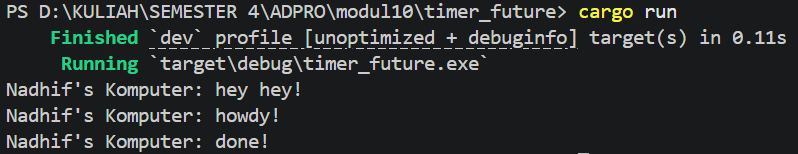
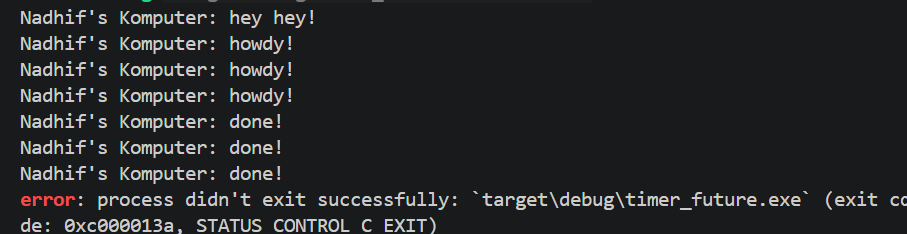

## Experiment 1.2: Understanding How It Works

Teks yang ditambahkan tepat setelah blok spawner.spawn langsung muncul di terminal tanpa menunggu jeda 2 detik karena fungsi spawn bersifat non-blocking, yang berarti ia hanya mendaftarkan tugas ke dalam antrean executor tanpa menghentikan eksekusi baris kode di bawahnya. Ketika program mencapai baris TimerFuture::new(...).await di dalam blok asinkronus, future tersebut akan melepaskan kontrol thread karena statusnya masih pending, sehingga thread utama langsung mengeksekusi perintah println! berikutnya secara sinkronus sementara timer berjalan di latar belakang. Teks "done!" baru akan muncul setelah durasi timer terpenuhi dan executor mendapatkan sinyal wake() untuk melanjutkan sisa tugas tersebut.

## Experiment 1.3: Multiple Spawn and Removing Drop

Saat mencoba melakukan multiple spawn, saya mengamati bahwa executor mampu menjalankan banyak tugas secara bersamaan (konkuren), di mana pesan "howdy!" dari berbagai tugas muncul hampir bersamaan sebelum masing-masing menyelesaikan timernya. Namun, ketika perintah drop(spawner) dihapus, program tidak kunjung selesai (hang) dan harus dihentikan paksa menggunakan Ctrl+C. Hal ini terjadi karena loop pada executor.run() akan terus menunggu kiriman tugas baru selama sender (Spawner) masih aktif. Dengan tidak memanggil drop, jumlah referensi ke sender dalam channel tersebut tidak pernah mencapai nol, sehingga ready_queue tetap terbuka karena menganggap masih ada kemungkinan tugas baru yang akan datang, yang mengakibatkan executor tidak pernah berhenti meskipun semua tugas yang ada sudah selesai dijalankan.